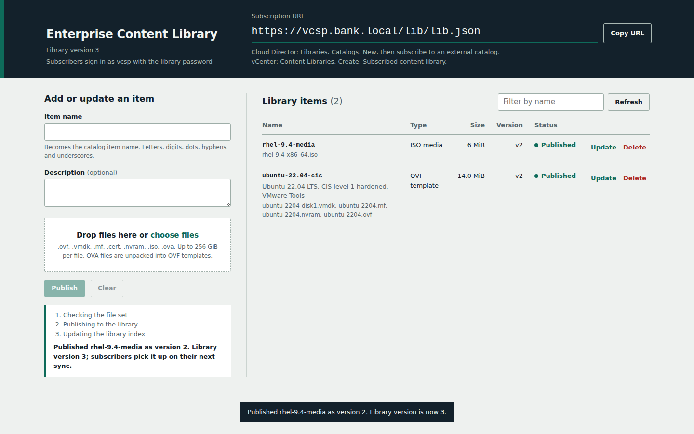

# VCSP external content library for VMware Cloud Director

A self-hosted third-party content library on Photon OS that VMware Cloud Director catalogs and vCenter content libraries subscribe to over HTTPS. It implements the VMware Content Subscription Protocol (VCSP) endpoint described in William Lam's articles on [third-party content libraries](https://williamlam.com/2015/06/creating-your-own-3rd-party-content-library-for-vsphere-6-0-vcloud-director-5-x.html) and [content libraries on Amazon S3](https://williamlam.com/2018/07/creating-a-vsphere-content-library-directly-on-amazon-s3.html), and adds an upload portal and an incremental indexer that replaces `make_vcsp_2018.py`.

```
            Cloud Director cells / vCenter (subscribers, user "vcsp")
                               |  HTTPS GET lib.json -> items.json -> item.json -> files
                               v
  +-------------------------- Photon OS 4/5 VM -------------------------------+
  |  nginx :443 (TLS, Basic auth, IP allow-lists, sendfile)                    |
  |   /lib/     -> DATA_ROOT/lib            read-only VCSP endpoint            |
  |   /upload/  -> /opt/vcsp/app/static     portal UI (admin Basic auth)       |
  |   /upload/api/ -> 127.0.0.1:8080        vcsp-upload.service (user vcsp)    |
  |                                             | publish: validate, move,     |
  |                                             v re-index one item            |
  |  vcsp-index (bin/vcsp-index) <- vcsp-index.timer (safety-net full scan)    |
  |   writes item.json, items.json, lib.json; state in /var/lib/vcsp           |
  +----------------------------------------------------------------------------+
```



Everything runs on the Python 3 standard library and the Photon OS base repositories: no pip, no virtualenv, no CDN. That keeps the dependency surface small for regulated environments and lets the whole stack install on an air-gapped host from a single signed-RPM bundle.

## What is in this folder

| Path | Purpose |
|---|---|
| `deploy.sh` | Installer and operations tool. Contains `download_prerequisites`, which builds the offline bundle. |
| `config/vcsp.conf` | All settings, shared by `deploy.sh` and both Python programs. Installed to `/etc/vcsp/vcsp.conf`. |
| `bin/vcsp-index` | The indexer that generates `lib.json`, `items.json` and every `item.json`. |
| `app/vcsp_upload.py` | Upload portal backend (resumable chunked uploads, publish and delete jobs). |
| `app/vcsp_validate.py` | Content checks: extension allow-list, magic bytes, OVA extraction, OVF and manifest validation. |
| `app/static/` | Portal web interface (HTML, CSS, JavaScript; no external assets). |
| `systemd/` | Hardened units for the backend and the indexer timer. |
| `tests/test_vcsp.py` | End-to-end tests (`python3 tests/test_vcsp.py -v`, no root needed). |
| `docs/portal.png` | Screenshot of the upload portal. |

On the server the same layout is mirrored under `/opt/vcsp`, so `/opt/vcsp/deploy.sh` can be re-run for any later operation.

## How the endpoint works

A subscriber is configured with one URL, `https://<SERVER_FQDN>/lib/lib.json`. On every sync it fetches `lib.json` and compares its `version` with the version it last synchronized; if they are equal it stops there. Only when the library version has grown does it read `items.json`, and it then fetches the `item.json` and files only for items whose own `version` has grown. The endpoint's single responsibility is therefore to keep IDs stable and to increase versions monotonically whenever an item is added, removed or changed, which is exactly what the indexer guarantees.

Folder layout under `DATA_ROOT/lib` (default `/srv/vcsp/lib`), one folder per item:

```
lib/
  lib.json                     library descriptor (subscription URL points here)
  items.json                   index of all published items
  ubuntu-22.04-cis/            OVF template  -> vcsp.ovf  -> VCD vApp template
    item.json
    ubuntu.ovf  ubuntu-disk1.vmdk  ubuntu.nvram  ubuntu.mf
  rhel-9.4-media/              one ISO       -> vcsp.iso  -> VCD media
    item.json
    rhel-9.4-x86_64.iso
  tools-isos/                  several ISOs  -> one vcsp.iso item per ISO
    vmtools.iso  drivers.iso
    vmtools/item.json  drivers/item.json
```

Item type follows the reference script: a folder containing an `.ovf` is `vcsp.ovf`; a folder of only `.iso` files is `vcsp.iso` (one media item per ISO, as the S3 variant of `make_vcsp_2018.py` does); anything else is `vcsp.other`. Cloud Director catalogs hold vApp templates and media, so `vcsp.other` items are only useful to vCenter subscribers. OVAs are not deployable from a subscription (content library treats them as plain files), which is why the portal unpacks them into OVF plus disks.

## Deploying on Photon OS

**Sizing.** Give the VM 2 vCPU and 4 GB RAM, and put `DATA_ROOT` on a dedicated data disk (for example an LVM volume mounted at `/srv/vcsp`) sized for every template and ISO plus headroom: uploads are staged on the same filesystem so publishing is an atomic rename, an OVA temporarily needs twice its size while it is unpacked, and `MIN_FREE_SPACE_GB` is kept free. Create a DNS record for `SERVER_FQDN` before installing.

**Online install.** Copy this folder to the VM, set at least `SERVER_FQDN` and `LIB_NAME` in `config/vcsp.conf`, then run the installer as root. It prompts for the portal administrator password and the library password (press Enter to have strong ones generated).

```bash
cd vcsp-content-library
vi config/vcsp.conf                     # SERVER_FQDN, LIB_NAME, allow-lists
./deploy.sh install
```

Prerequisites are only fetched when something is missing. The installer first checks which of the required packages are already installed: if none are missing it skips the download and installation entirely, otherwise it installs only the missing ones. Online installs use the same path as offline ones: `download_prerequisites` fills `/var/cache/vcsp/bundle`, the bundle is checksum- and signature-verified, and the missing packages are installed from it. A bundle that is already complete is reused rather than downloaded again. If the download fails, the installer falls back to a plain `tdnf install` of the missing packages.

**Air-gapped install.** On any internet-connected Photon OS host of the same major version, build the bundle, then carry the archive across:

```bash
./deploy.sh download-prereqs --archive
#  -> vcsp-offline-bundle-photon5/  (rpms/ + repodata, payload/, BUNDLE.txt, SHA256SUMS)
#  -> vcsp-offline-bundle-photon5.tar.gz and .sha256

# on the air-gapped host
sha256sum -c vcsp-offline-bundle-photon5.tar.gz.sha256
tar -xzf vcsp-offline-bundle-photon5.tar.gz
vcsp-offline-bundle-photon5/payload/deploy.sh install      # bundle is detected automatically
```

Re-running `download-prereqs` reuses an existing bundle when it is complete and intact: built for the same Photon OS release and package list, every required package present, and every RPM and metadata file matching its checksum. In that case only the project copy and checksums are refreshed. It downloads again only when something is missing or damaged (the log states which), or when you ask for newer package versions with `--refresh`; it reminds you to refresh when the RPMs are older than 30 days (`VCSP_BUNDLE_MAX_AGE_DAYS`). Downloads go to a scratch folder and replace the old RPMs only after they succeed, so a failed or interrupted download never destroys a working bundle.

`download_prerequisites` uses `tdnf install --downloadonly --alldeps`, which ignores the local RPM database, so the bundle carries the complete dependency closure of `nginx python3 python3-xml openssl iptables curl tar gzip util-linux shadow findutils logrotate` even when the download host already has some of them. Before installing, the bundle's `SHA256SUMS` are checked and every RPM signature is verified with `rpm -K` against the VMware keys shipped in `/etc/pki/rpm-gpg`; installation then resolves only from the bundle (`tdnf --repofrompath=vcsp-bundle,... --repo=vcsp-bundle`).

**Non-interactive install** (pipelines, Ansible):

```bash
VCSP_ADMIN_USER=libadmin VCSP_ADMIN_PASSWORD='...' VCSP_LIB_PASSWORD='...' \
  ./deploy.sh install --non-interactive
```

Any password not supplied is generated and written once to `/root/vcsp-initial-credentials.txt` (mode 0600); move it to your vault and delete the file. The install finishes by running `deploy.sh verify` (thirteen checks covering TLS, authentication, the backend and the index, including a signed-in download of `lib.json` through nginx with a temporary account that is removed afterwards) and prints the subscription URL and the certificate's SHA-256 fingerprint.

Photon OS ships `/srv` as a symbolic link to `/var/srv`, so with the default `DATA_ROOT=/srv/vcsp` the library physically lives in `/var/srv/vcsp/lib`. The installer resolves links in `DATA_ROOT` and `STATE_DIR` and gives nginx and systemd the real paths; links above the library are fine, but `lib/` and `staging/` themselves must be real folders or bind mounts.

What the installer changes on the host: it creates the `vcsp` system user; the folders `/opt/vcsp`, `/etc/vcsp`, `DATA_ROOT` and `STATE_DIR`; `/etc/nginx/nginx.conf` (the Photon original is kept as `nginx.conf.photon-default`); three systemd units with drop-ins; a logrotate rule when nginx has none; and, with `MANAGE_FIREWALL=yes`, iptables ACCEPT rules for TCP 443 and 80, persisted in `/etc/systemd/scripts/ip4save` because Photon OS drops inbound traffic except SSH by default.

## Subscribing

The subscription URL is `https://<SERVER_FQDN>/lib/lib.json`. VCSP clients always authenticate with the fixed user name `vcsp` over HTTP Basic authentication, so subscribers are only ever given the library password.

**Cloud Director (tenant portal).** The provider must first allow the organization to subscribe to external catalogs. Then go to Libraries, Catalogs, New; choose to subscribe to an external catalog; paste the URL and the library password; choose whether content downloads automatically or on demand. Cloud Director asks you to trust the server certificate the first time: compare the fingerprint with the one `deploy.sh status` prints, or import your CA into Administration, Certificate Management, Trusted Certificates.

**Cloud Director (API).**

```http
POST https://<vcd>/api/admin/catalog/<catalog-id>/action/subscribeToExternalCatalog
Content-Type: application/vnd.vmware.admin.externalCatalogSubscriptionParams+xml

<ExternalCatalogSubscriptionParams xmlns="http://www.vmware.com/vcloud/v1.5">
  <SubscribeToExternalFeeds>true</SubscribeToExternalFeeds>
  <Location>https://vcsp.example.local/lib/lib.json</Location>
  <Password>library-password</Password>
  <LocalCopy>false</LocalCopy>
</ExternalCatalogSubscriptionParams>
```

**vCenter.** Content Libraries, Create, Subscribed content library; enter the URL, enable authentication with the library password, and accept the certificate thumbprint.

## Using the upload portal

Browse to `https://<SERVER_FQDN>/upload/` and sign in as a portal administrator. Enter an item name (it becomes the catalog item name), optionally a description, drop the files and choose Upload and publish. Only the extensions in `ALLOWED_EXTENSIONS` are accepted (default `.ovf .vmdk .mf .cert .nvram .iso .ova`); the browser checks them for convenience and the server enforces them.

Files are sent in `UPLOAD_CHUNK_MB` pieces that stream straight to disk, so multi-hundred-gigabyte disks upload with constant memory and survive interruptions: after a dropped connection or a closed tab, choose the same file for the same item and the upload continues from the last byte the server holds. Each file's content is checked against its extension after the first chunk (a VMDK needs a sparse or streamOptimized header, an ISO an ISO 9660 or UDF descriptor, an OVA a tar header), so a mislabelled file is refused within seconds rather than after a long upload.

Publishing runs as a background job with visible steps. OVAs are unpacked in one streaming pass that refuses links, device files, sub-folders and path traversal; the item must contain exactly one OVF whose referenced files are all present with their declared sizes; and when a manifest is present, every SHA1/SHA256/SHA512 digest is verified in parallel (`VERIFY_MANIFEST`). Only then are the files moved into the library, under the same lock the indexer uses, and that single item is re-indexed. For an existing item, "Replace all of its files" swaps the whole folder atomically; "Add or overwrite individual files" merges, which suits adding ISOs to a media folder.

## Adding content without the portal

Content can also be copied in directly, for example with `rsync` from a staging share. Create one folder per item under `DATA_ROOT/lib`, make sure the `vcsp` user owns it, and either wait for the timer or index immediately:

```bash
rsync -a --chown=vcsp:vcsp ubuntu-22.04-cis/ vcsp:/srv/vcsp/lib/ubuntu-22.04-cis/
/opt/vcsp/deploy.sh reindex                   # or wait for vcsp-index.timer
vcsp-index --config /etc/vcsp/vcsp.conf --status
```

Files changed within the last `SETTLE_SECONDS` are held back so a copy in progress is never published, and an OVF item is published only when every file it references is present at the size the descriptor declares. If an already-published item becomes inconsistent, the indexer keeps serving its last good version and reports it as stale instead of withdrawing it from tenants.

## The indexer and why it is fast

`make_vcsp_2018.py` in local mode reads every byte of every file twice on every run (a folder MD5 used as the etag, plus a per-file MD5 that is computed and discarded) and rewrites every `item.json`. On a library of large templates that turns each refresh into minutes of disk I/O. `vcsp-index` keeps the same JSON schema and avoids that work:

It never reads file contents by default (`ETAG_MODE=stat`). A file's etag is `<mtime-hex>-<size-hex>`, the same value nginx returns as the HTTP `ETag` header for that file, so the index and the web server agree. Each item's stat signature is cached in `/var/lib/vcsp/state.json`, so an unchanged item costs one directory scan and one `stat()` per file, and no JSON is built for it. JSON files are rewritten only when their bytes change, atomically through a hidden temp file and rename. `items.json` is written with Python's C encoder (one item per line, still greppable), `lib.json` is written last as the commit point, and only `lib.json`, `items.json` and the state file are fsynced; per-item files record their size so a file a crash left truncated is detected and rewritten on the next run. The portal re-indexes only the item it touched (`--only ITEM`).

If tools on the server touch files without changing them (for example `rsync` without `-t`), switch to `ETAG_MODE=md5` or `sha256`: content hashes are computed once per new or changed file, in parallel, with sequential read-ahead and page-cache eviction hints, and cached afterwards. Changing the mode changes every etag and makes subscribers download everything again, so the indexer refuses unless you pass `--force`.

Measured on a 1-vCPU test VM, same data for both tools:

| Scenario | make_vcsp_2018.py | vcsp-index |
|---|---|---|
| 2,000 items, first build | 0.87 s | 0.70 s |
| 2,000 items, nothing changed | 0.82 s | 0.17 s |
| 4 templates / 2 GiB, first build | 8.0 s | 0.06 s |
| 4 templates / 2 GiB, nothing changed | 8.0 s | 0.06 s |

The 2 GiB rows were measured with the data in page cache, the best case for the reference script; on cold storage its cost grows with total library size, while `vcsp-index` stays proportional to the number of files.

**Migrating from `make_vcsp_2018.py`.** Point `DATA_ROOT` at the existing library and run the indexer. With no state file it adopts the existing `lib.json` and `items.json`: the library ID, item IDs, versions and existing etags are kept while file sizes match, so current subscribers see no change and download nothing. The one deliberate difference is a folder holding several ISOs, which becomes one media item per ISO (a single media item cannot hold two images in Cloud Director).

Useful indexer options: `--status` (list items and states from the state file), `--dry-run`, `--rebuild` (rewrite all JSON, IDs and versions kept), `--check` (exit code 4 when anything is waiting, incomplete or stale; suitable for monitoring), `--json` (machine-readable summary). Exit codes are 0 success, 2 another run holds the lock, 3 configuration error, 4 check failed.

## Security controls

| Area | Control |
|---|---|
| Transport | TLS 1.2/1.3 only, modern AEAD ciphers, HSTS. Self-signed certificate plus CSR on first install; `cert-install` swaps in a CA-signed one with key-match and SAN checks and automatic rollback. |
| Subscribers | HTTP Basic user `vcsp` (VCSP requirement) with a SHA-512-crypt password hash; optional `LIB_ALLOW_CIDRS`; `/lib/` allows only GET/HEAD, no directory listing, no symbolic links inside the library, no dot-files. |
| Portal | Separate administrator accounts (`add-admin`, `remove-admin`), optional `ADMIN_ALLOW_CIDRS`, rate limiting, audit lines with the user name for every upload, publish and delete in the journal. |
| Browser | Strict Content-Security-Policy (no inline or eval script, no third-party origins), `X-Frame-Options DENY`, `nosniff`, no referrer. State-changing API calls require a custom header and a same-origin `Origin`, which blocks CSRF against cached Basic credentials. |
| Uploads | Server-side extension allow-list, strict file and item name patterns, magic-byte checks on the first chunk, size limits, free-space reserve, OVA extraction that refuses traversal, links and devices, OVF completeness and manifest digest verification before anything reaches the library. |
| Processes | Backend and indexer run as the unprivileged `vcsp` user under systemd sandboxing (`ProtectSystem=strict`, empty capability set, `NoNewPrivileges`, write access limited to `DATA_ROOT` and `STATE_DIR`; the indexer also has no network). The backend listens on loopback only and refuses to run as root. |
| Supply chain | Standard library only; offline bundle integrity by SHA-256 and RPM signature verification. Hash functions are called with `usedforsecurity=False`, so manifest checks keep working when OpenSSL runs in FIPS mode. |

## Operations

```bash
/opt/vcsp/deploy.sh status                     # services, items and states, disk, URL, fingerprint
/opt/vcsp/deploy.sh verify                     # re-run the deployment checks
/opt/vcsp/deploy.sh reindex [--rebuild]        # index now (as the vcsp user)
./deploy.sh download-prereqs --refresh --archive   # rebuild the offline bundle with current Photon OS packages
/opt/vcsp/deploy.sh add-admin alice            # add or reset a portal user
/opt/vcsp/deploy.sh remove-admin alice
/opt/vcsp/deploy.sh set-library-password       # then update each subscriber's password
/opt/vcsp/deploy.sh cert-csr                   # /etc/vcsp/tls/server.csr for your CA
/opt/vcsp/deploy.sh cert-install server.crt server.key [chain.pem]
/opt/vcsp/deploy.sh uninstall [--purge]        # --purge also deletes library data (asks to confirm)
journalctl -u vcsp-upload -u vcsp-index -f     # audit trail and index runs
```

After editing `/etc/vcsp/vcsp.conf`, run `/opt/vcsp/deploy.sh install` again; it is idempotent, keeps existing certificates and passwords, and re-renders nginx and systemd from the new values.

For backup, protect `DATA_ROOT/lib` (the content), `/var/lib/vcsp/state.json` (IDs, versions and cached etags) and `/etc/vcsp` (configuration, password hashes, TLS key). If the state file is lost, the indexer re-adopts IDs and versions from `items.json`, so subscribers are not disturbed. For monitoring, alert on `vcsp-index --check` returning 4, on `systemctl is-active vcsp-upload nginx`, and on free space in `DATA_ROOT`.

## Configuration reference

| Setting | Default | Meaning |
|---|---|---|
| `LIB_NAME` | Enterprise Content Library | Library name shown to subscribers. Changing it raises the library version. |
| `SERVER_FQDN` | vcsp.example.local | DNS name in the URL and certificate. The installer offers `hostname -f` if left unchanged. |
| `PUBLIC_BASE_URL` | https://SERVER_FQDN | Override when a load balancer fronts the server. |
| `DATA_ROOT` | /srv/vcsp | Library (`lib/`) and staging (`staging/`), on one filesystem. |
| `STATE_DIR` | /var/lib/vcsp | Indexer state and lock. |
| `LIB_AUTH` | basic | `basic` (user `vcsp`) or `none`. |
| `LIB_ALLOW_CIDRS` / `ADMIN_ALLOW_CIDRS` | empty | Space-separated addresses or CIDRs allowed to reach `/lib/` or the portal. |
| `ALLOWED_EXTENSIONS` | ovf vmdk mf cert nvram iso ova | Upload allow-list. |
| `UPLOAD_CHUNK_MB` | 64 | Size of each resumable upload request (1-512). |
| `MAX_FILE_SIZE_GB` | 256 | Largest single file. |
| `MIN_FREE_SPACE_GB` | 20 | Free space that uploads may not consume. |
| `VERIFY_MANIFEST` | yes | Verify `.mf` digests before publishing. |
| `OVA_EXTRACT` | yes | Unpack OVAs into OVF templates. |
| `ALLOW_DELETE` | yes | Allow deleting items from the portal. |
| `STAGING_TTL_HOURS` | 72 | Age after which abandoned uploads are removed. |
| `ETAG_MODE` | stat | `stat`, `md5` or `sha256`. |
| `SKIP_CERT` | yes | Leave `.cert` files out of OVF items, as the reference script does. |
| `SETTLE_SECONDS` | 120 | Quiet time before manually copied files are published. |
| `INDEX_INTERVAL` | 5min | Period of the safety-net full scan. |
| `HASH_WORKERS` | 0 (auto) | Threads for content etags and manifest checks. |
| `HTTP_REDIRECT` | yes | Listen on port 80 and redirect to HTTPS. |
| `LISTEN_IPV6` | no | Also listen on IPv6 (the kernel must have IPv6 enabled, or nginx will not start). |
| `MANAGE_FIREWALL` | yes | Open and persist ports in Photon's iptables. |
| `UPLOAD_LISTEN` / `UPLOAD_PORT` | 127.0.0.1 / 8080 | Backend address behind nginx. |

## Troubleshooting

**Cloud Director reports "Unable to access URL".** The subscription URL must end in `lib.json` and return a valid descriptor. From a VCD cell run `curl -k -u vcsp https://<fqdn>/lib/lib.json`; a 401 means a wrong password, 403 means the cell's address is not in `LIB_ALLOW_CIDRS`, and a TLS error means the certificate is not trusted or does not name the FQDN.

**`lib.json` returns 404 and the nginx error log shows `(20: Not a directory)`.** A folder in the library path is a symbolic link that nginx refused. `deploy.sh` 1.0.0 did not resolve Photon's `/srv -> /var/srv` link; install 1.0.1 or later and re-run `deploy.sh install`, which renders the real path. If `lib/` or `staging/` itself is a link, the installer stops and explains: set `DATA_ROOT` to the real folder or use a bind mount (`mount --bind /data/vcsp /srv/vcsp` plus an `/etc/fstab` entry).

**An item stays "Waiting".** Its files changed less than `SETTLE_SECONDS` ago; the next timer run publishes it. Items published through the portal skip this delay.

**An item is "Incomplete" or "Serving previous version".** The reason column names the missing file or size mismatch against the OVF. Fix the folder and run `deploy.sh reindex`.

**Subscribers re-download everything after maintenance.** In `stat` mode, anything that rewrites file timestamps changes etags. Preserve timestamps (`rsync -a`, `cp -p`) or switch to a content `ETAG_MODE` with `--force` once.

**nginx does not start after enabling IPv6.** The host kernel has IPv6 disabled; set `LISTEN_IPV6=no` and re-run the installer.

**Upload portal returns 413 or 502.** Check that `UPLOAD_CHUNK_MB` was applied by re-running the installer, and read `journalctl -u vcsp-upload`.

## References

William Lam, [Creating your own 3rd Party Content Library for vSphere 6.0 & vCloud Director 5.x](https://williamlam.com/2015/06/creating-your-own-3rd-party-content-library-for-vsphere-6-0-vcloud-director-5-x.html) (2015) and [Creating a vSphere Content Library directly on Amazon S3](https://williamlam.com/2018/07/creating-a-vsphere-content-library-directly-on-amazon-s3.html) (2018); the reference indexer [make_vcsp_2018.py](https://github.com/lamw/vmware-scripts/blob/master/python/make_vcsp_2018.py); Broadcom TechDocs, *Content Subscription Endpoint Specification* for VMware Cloud Director 10.6; Broadcom KB 376563 on "Unable to access URL" errors for subscribed catalogs.
